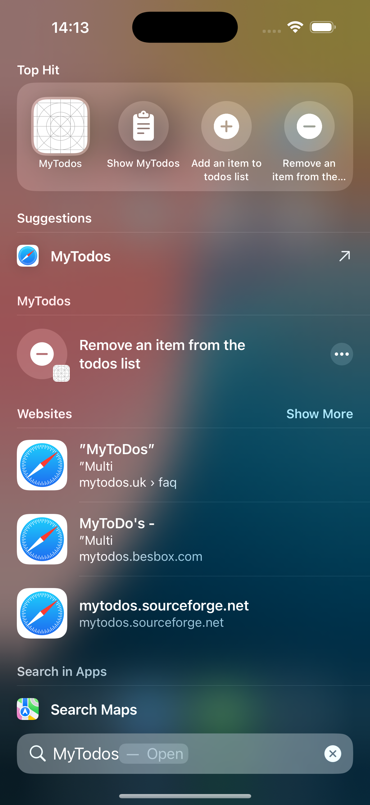

# My To-Dos App Intents 

Hi! 👋

This is the sample app for the article '[Bringing App Intents to your SwiftUI App](https://tiagohenriques.vercel.app/blog/bringing-app-intents-to-your-swiftui-app)' on a to-dos app including App Intents and Siri Shortcuts.
 

  
  

## Technologies
- SwiftUI
- App Intents
- Siri Integration
- App Shortcuts
- SwiftData

Have a nice day,
 
Tiago
